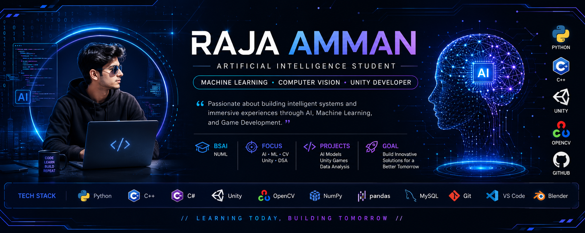

  

  

  
  
  

<h3 align="center">
Artificial Intelligence Student • Machine Learning Enthusiast • Unity Developer
</h3>

Passionate about building intelligent systems through Artificial Intelligence, Machine Learning, Computer Vision, and Unity development. I enjoy transforming ideas into practical solutions while continuously expanding my knowledge of modern AI technologies.

---

# 🎓 Education

🎓 **Bachelor of Science in Artificial Intelligence (BSAI)**

📍 National University of Modern Languages (NUML)

---

# 🚀 Current Focus

- 🤖 Artificial Intelligence
- 🧠 Machine Learning
- 👁️ Computer Vision
- 🎮 Unity Game Development
- 🐍 Python Development
- 📊 Data Analysis
- 📚 Data Structures & Algorithms
- 💡 Problem Solving

---

# 🛠 Tech Stack

---

# 📖 Academic Interests

- Artificial Intelligence
- Machine Learning
- Computer Vision
- Deep Learning
- Reinforcement Learning
- Data Science
- Prompt Engineering
- Software Development
- Game Development

---

# 🏆 Certifications

- 🏅 Google AI for App Building
- 🏅 Google AI for Data Analysis
- 🏅 Google AI Fundamentals
- 🏅 Google for Content Creation
- 🏅 Google for Research & Insights
- 🏅 Google for Brainstorming & Planning
- 🏅 Google for Writing & Communication
- 🏅 Introduction to Networking
- 🏅 Microsoft Office Specialist – Word Associate (Office 2019)
- 🏅 Introduction to Computer Vision
- 🏅 Google A.I Professional
- 🏅 IBM Develop Generative AI Applications

---

# 🚀 Featured Projects

| Project | Description |
|---------|-------------|
| 🎮 Rise of Machines | AI-powered survival horror game developed in Unity. |
| 🩺 Heart Disease Prediction | Machine Learning model for disease prediction and patient risk analysis. |
| 👁️ Computer Vision Labs | OpenCV-based image processing and computer vision experiments. |
| 🤖 AI & ML Projects | Collection of machine learning and AI-based academic projects. |
| 🧠 Data Structures & Algorithms | Academic implementations of DSA concepts using C++ and Python. |
---
<picture>
  <source
    media="(prefers-color-scheme: dark)"
    srcset="https://raw.githubusercontent.com/Platane/snk/output/github-contribution-grid-snake-dark.svg" />
  
</picture>

# 📊 GitHub Analytics

---

# 🌐 Connect With Me

---

---

<h3 align="center">
⭐ Learning today, Building tomorrow ⭐
</h3>
