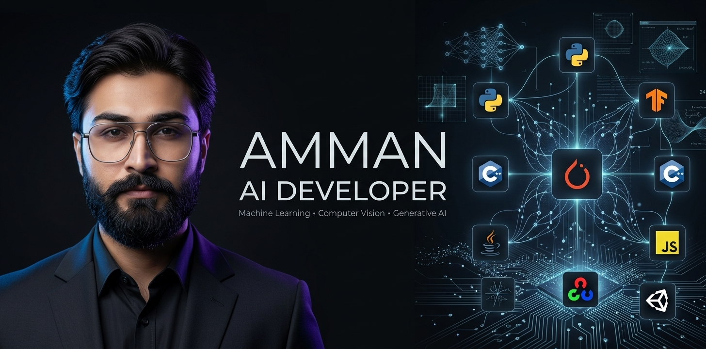

<p align="center">
  
</p>

<div align="center">

<a href="https://git.io/typing-svg">

</a>

<br>

<a href="https://github.com/amanmani07?tab=followers">

</a>

<a href="https://github.com/amanmani07">

</a>


</div>

<h3 align="center">
Artificial Intelligence Student • Machine Learning • Computer Vision • Generative AI • Unity
</h3>

<p align="center">
I am an Artificial Intelligence student focused on building practical intelligent systems using Machine Learning, Deep Learning, Computer Vision, Generative AI, NLP, Reinforcement Learning, and intelligent automation.
</p>

<p align="center">
I enjoy transforming ideas into practical applications and continuously exploring modern AI technologies.
</p>

---

# 🧠 AI & Intelligent Systems

<table>
<tr>

<td width="50%">

### 🤖 Machine Learning

- Supervised Learning
- Classification
- Regression
- Feature Engineering
- Model Evaluation
- Predictive Analytics

</td>

<td width="50%">

### 🧬 Deep Learning

- Neural Networks
- CNNs
- Representation Learning
- Transfer Learning
- Model Training
- Model Optimization

</td>

</tr>

<tr>

<td>

### 👁️ Computer Vision

- Object Detection
- Object Tracking
- Image Classification
- Image Processing
- OpenCV
- YOLO

</td>

<td>

### 🧠 Generative AI

- Large Language Models
- Retrieval-Augmented Generation
- Embeddings
- Semantic Search
- Prompt Engineering
- AI Automation

</td>

</tr>

<tr>

<td>

### 🎯 Reinforcement Learning

- Environment Design
- Reward Engineering
- Policy Learning
- Agent Behavior
- PPO
- Adaptive AI Agents

</td>

<td>

### 🗣️ Natural Language Processing

- Text Classification
- TF-IDF
- Text Preprocessing
- Semantic Search
- Text Summarization
- NLP Pipelines

</td>

</tr>

</table>

---

# 🚀 Featured AI Projects

## 📧 Email Spam Classification Engine

<a href="https://github.com/amanmani07/spam-classifier">

</a>

An end-to-end Natural Language Processing system designed to automatically classify messages as **Spam or Not Spam**.

### 🔬 Machine Learning Pipeline

```text
                    RAW EMAIL / MESSAGE
                            │
                            ▼
                  TEXT PREPROCESSING
                            │
                            ▼
                    TF-IDF VECTORIZATION
                            │
                            ▼
               MULTINOMIAL NAIVE BAYES
                            │
                            ▼
                   SPAM CLASSIFICATION
                            │
                            ▼
                    FINAL PREDICTION
